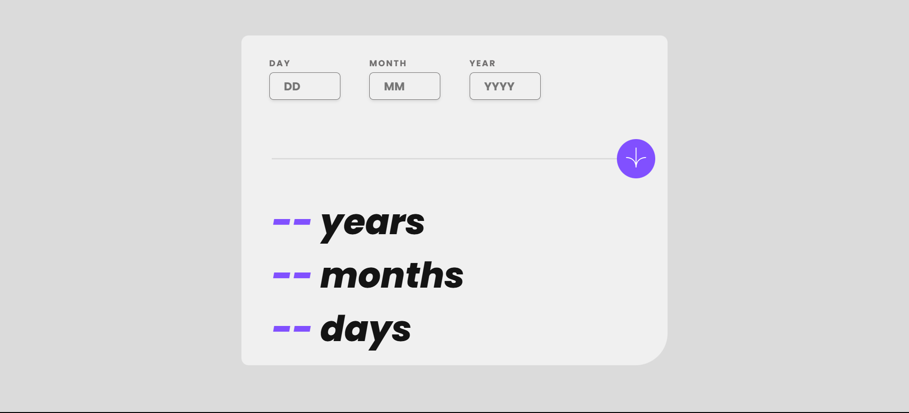

# Frontend Mentor - Age calculator app solution

This is a solution to the [Age calculator app challenge on Frontend Mentor](https://www.frontendmentor.io/challenges/age-calculator-app-dF9DFFpj-Q). Frontend Mentor challenges help you improve your coding skills by building realistic projects. 

## Table of contents

- [Overview](#overview)
  - [The challenge](#the-challenge)
  - [Screenshot](#screenshot)
  - [Links](#links)
- [My process](#my-process)
  - [Built with](#built-with)
  - [What I learned](#what-i-learned)
  - [Continued development](#continued-development)
  - [Useful resources](#useful-resources)
- [Author](#author)
- [Acknowledgments](#acknowledgments)


## Overview

### The challenge

Users should be able to:

- View an age in years, months, and days after submitting a valid date through the form
- Receive validation errors if:
  - Any field is empty when the form is submitted
  - The day number is not between 1-31
  - The month number is not between 1-12
  - The year is in the future
  - The date is invalid e.g. 31/04/1991 (there are 30 days in April)
- View the optimal layout for the interface depending on their device's screen size
- See hover and focus states for all interactive elements on the page
- **Bonus**: See the age numbers animate to their final number when the form is submitted

### Screenshot




### Links

- []()
- []()

## My process

For this project, I also followed the mobile-first approach, started by building the main component which would contain child components.

The first component is `Inputs.jsx` which contains the inputs, each input has its own component: 

`Inputs.jsx`:
```jsx
import DayInput from "./DayInput"
import MonthInput from "./MonthInput"
import YearInput from "./YearInput"
const Inputs = () => {
  return (
    <div className='inputs-component'>
      <DayInput />
      <MonthInput />
      <YearInput />
    </div>
  )
}
export default Inputs
```

- All inputs had the same structure, which is: 
```jsx
const DayInput = () => {
  return (
    <div className='day-component'>
      <h2 className="day-title poppins-bold">DAY</h2>
      <div className="day-number-container">
        <label htmlFor="day-input"></label>
        <input type="number" className="day-input poppins-bold" id="day-input"/>
      </div>
    </div>
  )
}
export default DayInput
```
- I initialized a state variable for each input that would hold the value entered by the user. I then passed the state updater functions to their corresponding input components in which I'd validate the input and store the value in the state:
`App.jsx`:
```jsx
import { useState } from "react"
import Inputs from "./components/Inputs"
import Button from "./components/Button"
const App = () => {
  const [day, setDay] = useState(null);
  const [month, setMonth] = useState(null);
  const [year, setYear] = useState(null);
  return (
    <div className='main-component'>
      <Inputs 
        setDay={setDay}
        setMonth={setMonth}
        setYear={setYear}
      />
      <p className="error-whole-form hidden">Must be a valid date</p>
      <Button />
    </div>
  )
}
export default App
```

- Here's how I handled the validation: 
`DayInput.jsx`:
```jsx
import { useState } from "react";

const DayInput = (props) => { 
  
  const [error, setError] = useState(false)
  const getDayInputValue = (event) => {
    let day = parseInt(event.target.value, 10);
    if ( day > 0 && day <= 31) {
      props.setDay(day);
    } else {
      alert("Invalid Day");
    }
  }
  
  return (
    <div className='day-component'>
      <h2 className="day-title poppins-bold">DAY</h2>
      <div className="day-number-container">
        <label htmlFor="day-input"></label>
        <input 
          type="number" 
          className="day-input poppins-bold" 
          id="day-input"
          onChange={(event) => getDayInputValue(event)}
        />
      </div>
      <p className="error-empty hidden">This field is required</p>
      <p className="error-invalid hidden">Must be a valid day</p>
    </div>
  )
}
export default DayInput
```
This was the initial version, I'd be replacing the `alert` message with UI feedback later on.

- I then created the `Button.jsx` component:
`Button.jsx`:
```jsx
import ArrowIconSVG from "./ArrowIconSVG"

const Button = () => {
  return (
    <div className='button-component'>
      <button className='age-button'><ArrowIconSVG /></button>
      <div className="divider"></div>
    </div>
  )
}
export default Button 
```
I created the components for outputs:
- `DayOutput.jsx`
- `MonthOutput.jsx`
- `YearOutput.jsx`
And they are all contained inside their parent component `Outputs.jsx`

Inside `App.jsx`, I created the `handleButton` function which performs the last step of the validation process (checking the leap year and how many days are in each month):

`App.jx`:
```jsx
const handleButton = () => {
    if (!day || !month || !year) {
      setError("invalid");
      return;
    }

    const daysInMonth = [0, 31, 28, 31, 30, 31, 30, 31, 31, 30, 31, 30, 31];

    const isLeapYear = (year % 4 === 0 && year % 100 !== 0) || (year % 400 === 0);
    if (month === 2 && isLeapYear) {
      daysInMonth[2] = 29;
    }

    if (day > daysInMonth[month]) {
      setError("invalid");
      return;
    }
    setError("");
    const today = new Date()
    const currentYear = today.getFullYear();
    const currentMonth = today.getMonth() + 1;
    const currentDay = today.getDate();

    let years = currentYear - year;
    let months = currentMonth - month;
    let days = currentDay - day;
  
    if (days < 0) {
      months--;
      let previousMonth = currentMonth === 1 ? 12 : currentMonth - 1;
      let daysInPreviousMonth = new Date(currentYear, previousMonth, 0).getDate();
      days += daysInPreviousMonth;
    }
  
    if (months < 0) {
      years--;
      months += 12;
    }

    setOutputDay(days);
    setOutputMonth(months);
    setOutputYear(years);
    setValid(true);
};
```
I also declared a state variable for each output component along with a `valid` state variable that is set to `true` when all inputs are validated:
`App.jsx`:
```jsx
const [outputDay, setOutputDay] = useState(null);
const [outputMonth, setOutputMonth] = useState(null);
const [outputYear, setOutputYear] = useState(null);
const [valid, setValid] = useState(false);
```
- Here's how I handled errors (same principle applies for all components):

`DayInput.jsx`:
```jsx
...
const [error, setError] = useState("")
const getDayInputValue = (event) => {   
  if (!event.target.value) {
    setError("empty");
    return
  } else {
    let day = parseInt(event.target.value, 10);
    if (day <= 0 || day > 31) {
      setError("invalid");
    } else {
      setError("");
      props.setDay(day);
    }
  }
}
...
<div className="day-number-container">
  <label htmlFor="day-input"></label>
  <input 
    type="number" 
    placeholder="DD"
    className="day-input poppins-bold" 
    id="day-input"
    onChange={(event) => getDayInputValue(event)}
  />
</div>
<div className="error-container">
  <p className={`error-empty ${error != "empty" && 'hidden'}`}>This field is required</p>
  <p className={`error-invalid ${error != "invalid" && 'hidden'}`}>Must be a valid day</p>
</div>
...
```
And in order for the errors to not overlap each other, I created the `handleInputChange` function inside `App.jsx` that would be executed whenever the user deleted/typed inside the input field:
```jsx
const handleInputChange = (setter) => (value) => {
  setter(value);
  setError("");
};
...
return (
  <div className="main-component">
    <Inputs
      setDay={handleInputChange(setDay)}
      setMonth={handleInputChange(setMonth)}
      setYear={handleInputChange(setYear)}
    />
    <p className={`error-whole-form ${error !== "invalid" ? "hidden" : ""}`}>
      Must be a valid date
    </p>
    <Button handleButton={handleButton} />
    <Outputs 
      years={outputYear}
      months={outputMonth}
      days={outputDay}
      valid={valid}
    />
  </div>
);
...
```
The last part was about passing the outputs to their corresponding components along with the `valid` state variable.
`DayOutput.jsx`:
```jsx
const DayOutput = (props) => {
  return (
    <div className='day-output-container'>
      <h1 className='day-result'><span className='days-number'>{props.valid ? props.days :  <><span className="dash">-</span><span className="dash">-</span></>}</span> days</h1>
    </div>
  )
}
export default DayOutput
```
### Built with

- Semantic HTML5 markup
- CSS custom properties
- Flexbox
- CSS Grid
- Mobile-first workflow
- [React](https://reactjs.org/) - JS library
- [Next.js](https://nextjs.org/) - React framework

### What I learned


### Continued development


### Useful resources


## Author

- GitHub - [ziad-rima](https://github.com/ziad-rima)
- Frontend Mentor - [@ziad-rima](https://www.frontendmentor.io/profile/ziad-rima)
- X - [@rima4082](https://x.com/rima4082)


## Acknowledgments

